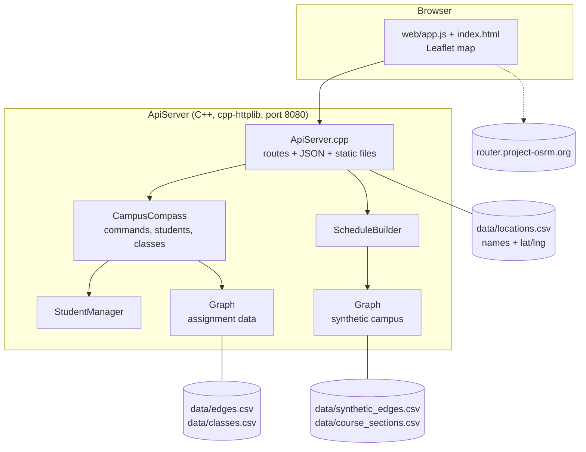

# Architecture

## Overview

## Components (in plain terms)

| Piece | Role | File |
|---|---|---|
| Graph | Buildings as nodes, walking time as edge weight. Shortest path, "is the campus connected," and minimum connecting network. Edges can be closed. | `src/Graph.cpp` |
| CampusCompass | Parses and validates commands (add student, drop class, ...), owns students and the class catalog. | `src/CampusCompass.cpp` |
| ScheduleBuilder | Given home and courses, tries section combinations and picks the least total walking. | `src/ScheduleBuilder.cpp` |
| ApiServer | Exposes the above as JSON endpoints and serves the web UI. | `src/ApiServer.cpp` |
| Web UI | Map, tabs, searchable selects, travel-mode toggle. | `web/` |

## API surface (from `src/ApiServer.cpp`)

- Map data: `GET /api/locations`, `GET /api/edges`, `GET /api/isConnected`, `POST /api/edges/toggle`
- Routing: `GET /api/shortest-path`
- Students: `GET/POST /api/students`, `GET/DELETE /api/students/{id}`, `POST .../dropClass`, `POST .../replaceClass`, `GET .../shortest-edges`, `GET .../zone`, `GET .../verify-schedule`
- Classes: `GET /api/classes`, `DELETE /api/classes/{code}`
- Builder: `GET /api/schedule-builder/courses`, `POST /api/schedule-builder/recommend`

## Key data flow: schedule recommendation

1. UI posts home location and course codes.
2. `ScheduleBuilder::recommend` loads every section for each course.
3. Backtracking picks one section per course, skipping overlaps.
4. For each full combination: sort by start time, sum Dijkstra distances home → section 1 → section 2 → ...; skip if any leg is unreachable.
5. Keep the minimum; return sections, legs, and leave-by minutes.

## Constraints and tradeoffs

- **State is in memory.** Students vanish on server restart. Fine for a prototype, wrong for a product.
- **Complexity.** Dijkstra is O((V+E) log V) with lazy deletion; see [algorithms-report.md](algorithms-report.md). The builder multiplies by the number of section combinations; Dijkstra runs are cached per source location.
- **Dependencies.** Catch2 and cpp-httplib via CMake FetchContent; Leaflet and OSRM at runtime from the network (`web/index.html`, `web/app.js`).
- **Two graphs.** Assignment data and synthetic data are not reconciled.
- **Reliability.** Route drawing silently degrades to straight lines if OSRM fails. The server binds to `0.0.0.0:8080` with no authentication, so it should not be exposed beyond local use.
