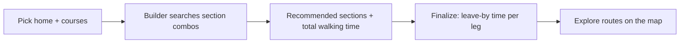
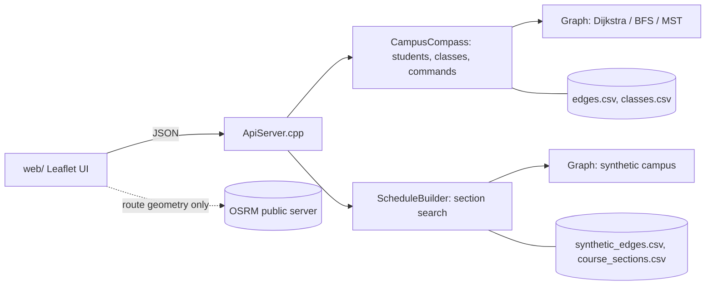

# Campus Compass

**A campus routing and class-schedule planner for UF students: it shows the fastest way between buildings, flags schedules you can't physically make, and picks the course sections that minimize walking.**

<!-- TODO(owner): add a screenshot or GIF of the map UI here (web/index.html served by ApiServer). No screenshot exists in the repo yet. -->

Campus Compass started as a graded data-structures project (a C++ graph engine with Dijkstra, BFS and Kruskal's MST, driven by a text command grammar). I then extended it into a small product: a local HTTP API (`src/ApiServer.cpp`) and a Leaflet map UI (`web/`) with three workflows: point-to-point routing, student schedule checks, and a section-level schedule builder. Maturity: **course project extended into a working prototype**. It has no real users and no deployment.

## Why This Exists

A class schedule is a routing problem that students solve by hand. Two classes ten minutes apart might be a two-minute walk or an impossible sprint across campus. The tools students have (the registrar's course list, a general map app) don't connect the two. A course list has times but no travel cost, and a map app has distances but no idea what your next class is.

Campus Compass puts both in one model: buildings are graph nodes, walking times are edge weights, and classes are time windows at nodes. That lets it answer two questions: *can I make it from class A to class B?* and *which combination of sections gives me the least walking?*

> This framing is my product hypothesis. I did not run user research for this project.

## Who It's For

Intended user: a UF undergraduate building or checking a semester schedule, especially someone living in a far residence hall. The UFID format validation, UF building names and residence-hall data in `data/` all point at this audience.

## The Product

Three tabs in the web UI (`web/index.html`):

| Tab | What the user does | Backing endpoint |
|---|---|---|
| **Explore** | Pick any two buildings and see the shortest route, time and step list. Switch between Walk, Bike and Drive. | `GET /api/shortest-path` |
| **Students** | Add a student (name, UFID, residence, 1-6 classes). Verify whether their schedule is physically feasible, see shortest routes to each class, and see the minimum "zone" connecting home and classes. Close or reopen a road to see routes change. | `/api/students/*`, `/api/edges/toggle` |
| **Schedule Builder** | Choose courses (not sections), pick a home location, and get the section combination with the least total walking, plus "leave by" times per leg. | `POST /api/schedule-builder/recommend` |

## Core User Journey



## Product Decisions

Full reasoning, with code pointers, is in [docs/product-decisions.md](docs/product-decisions.md). The short version:

1. **Keep the Schedule Builder's synthetic data separate from the graded graph.** Gain: demo data can't break the original assignment tests. Cost: the builder's numbers are not real UF data. (`src/ScheduleBuilder.h`)
2. **Make course sections the unit of optimization, not courses.** Students choose between sections, so the builder searches one section per course, drops time-overlapping combinations, and minimizes total walking. Cost: exponential in the worst case; fine for at most 6 courses with a handful of sections each.
3. **Use a real routing service only to draw lines; the graph stays the source of truth for times.** Walk/Bike/Drive uses OSRM's public server for geometry. Cost: the drawn route and the reported minutes can disagree, and the public server has no uptime guarantee.
4. **Fall back to a straight line when walking routes look wrong.** OSM's campus footpaths are incomplete, so short legs with a large detour ratio are drawn directly. Cost: the thresholds (under 300 m, over 1.6x) are a heuristic, not measured.
5. **Let users close roads.** Closing an edge and re-running routes shows the graph handling disruptions. Closures were an assignment requirement that I surfaced in the UI.

## What I Owned

Git history shows a single author (`phammy237`, 5 commits, Jul 31 to Aug 5, 2026). This describes what the repo contains, not a split of credit on a team.

**Product (as evidenced in the repo)**
- Extended a command-line assignment into a three-workflow product (commit `6d8bdad`, "add ui and functions").
- Added the Schedule Builder as a separate feature, then Walk/Bike/Drive modes (commit `7d28fbb`).
- Wrote the design report with complexity analysis and reflections ([docs/algorithms-report.md](docs/algorithms-report.md)).

**Technical**
- Graph engine: `src/Graph.cpp` (Dijkstra with lazy deletion, BFS connectivity, Kruskal MST), `src/CampusCompass.cpp` (command grammar and validation), `src/StudentManager.cpp`.
- Section search: `src/ScheduleBuilder.cpp` (backtracking with a Dijkstra cache).
- HTTP API: `src/ApiServer.cpp` (18 routes, cpp-httplib).
- Frontend: `web/app.js`, `web/index.html`, `web/style.css` (Leaflet map, searchable selects, tabs).
- Tests: Catch2 suite in `test/test.cpp` (5 test cases: validation, edge cases, student commands, road closures, end-to-end scenario). Nothing tests `ApiServer` or `ScheduleBuilder`.

> Git can't show how the assignment starter code or any tooling contributed. Please confirm this framing.

## Success Metrics

### Observed
None. The prototype has no analytics, users or usage data.

What the repo does support: the tests assert algorithm correctness on the sample data, and the design report documents one correctness finding (student-zone MST cost 27, versus 29 if you wrongly use the shortest-path tree).

### Proposed
If deployed, I would track (details in [docs/metrics.md](docs/metrics.md)):
- **North star:** schedules finalized per active student.
- **Quality:** share of recommended schedules kept without edits; leave-by times versus real walking times.
- **Guardrail:** routing-service failure rate and straight-line fallback rate.

## Architecture



Two independent graphs: a small one from the assignment's sample data, and an expanded synthetic one for the builder. Details: [docs/architecture.md](docs/architecture.md).

## Product Documentation

- [Product brief](docs/product-brief.md)
- [Product decision log](docs/product-decisions.md)
- [Metrics framework (proposed)](docs/metrics.md)
- [Architecture for PMs and engineers](docs/architecture.md)
- [Roadmap](docs/roadmap.md)
- [Retrospective](docs/retrospective.md)
- [Algorithm design report](docs/algorithms-report.md) (original course report)

## Roadmap

- **Now:** replace synthetic walking times with real ones; add tests for the builder and API; persist students.
- **Next:** respect real constraints (building hours, walking speed, bike/drive in the builder).
- **Later:** import real registrar section data; validate with real students.

Reasoning for each is in [docs/roadmap.md](docs/roadmap.md).

## What I Learned

- Check the data before designing around it. The sample graph is four components, not one, and the obvious MST input gives the wrong cost.
- A prototype that mixes real and synthetic data needs that boundary visible in code and UI. The Schedule Builder tab carries an on-screen disclaimer for this reason.
- More in [docs/retrospective.md](docs/retrospective.md).

## Technical Setup

Requires CMake and a C++17 compiler. Catch2 and cpp-httplib are fetched by CMake (`CMakeLists.txt`).

```bash
cmake -S . -B build
cmake --build build
# targets: Main (stdin command interface), Tests (Catch2), ApiServer (UI + API on http://localhost:8080)
```

CMake copies `data/` and `web/` into the build directory; run `ApiServer` from there so it finds them. I have not re-run the build as part of this documentation pass. Editor setup (CLion, VSCode, Codespaces) from the course template is kept in [docs/dev-environment-template.md](docs/dev-environment-template.md).
